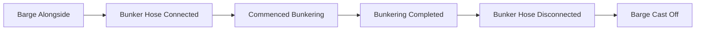
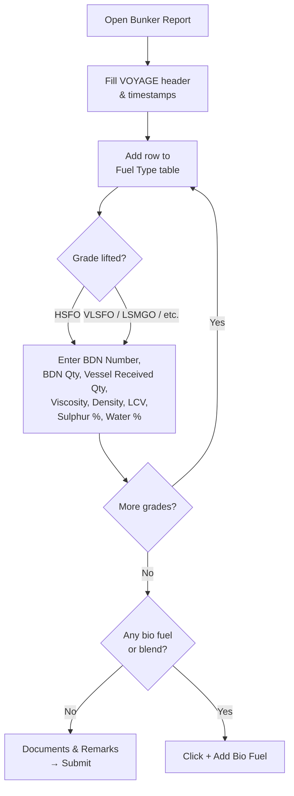
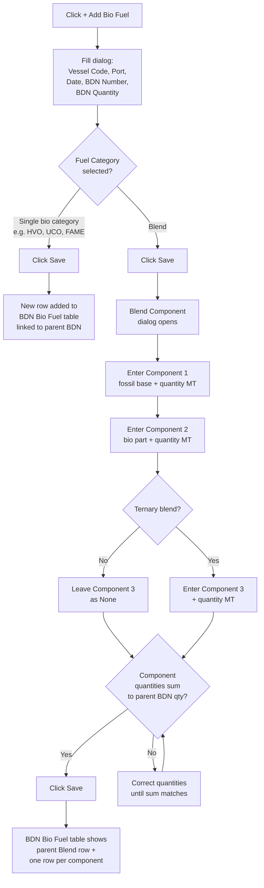

<Card title="Download PDF" icon="file-pdf" href="/pdfs/06-Bunker-Report.pdf">Open the original PDF guideline</Card>

The Bunker Report records **every bunker lifting** — fuel supplied from a barge, ex-pipe from a terminal, or ship-to-ship from another vessel. It is submitted **in addition to** the usual Noon / Arrival / Departure reports for the same day, never as a replacement.

**When to send:** At the completion of every bunkering, before the next scheduled performance report.

<Note>
The submission flow (Submit → copy encoded block → paste into a plain-text Outlook email) is the same as for every other Metaweave form. See the Forms Guidelines → Submission of Metaweave Forms for the email template, recipient list, and subject-line rules.
</Note>

---

## Bunker Event Timeline

All six timestamps must form a **monotonic chain** — each event must be at or after the previous one. The validation layer will block submission if they are out of order.

---

## VOYAGE Section

### Header fields

| Field | Meaning |
|-------|---------|
| Voyage Number | Current voyage number. |
| Port | Port where the bunker was lifted. Use the autocomplete. |
| Supplier | Bunker supplier name. Use the autocomplete. |
| Barge Name | Name of the supply barge. Leave blank for ex-pipe delivery. |
| Barge Alongside | Local date / time the barge came alongside + GMT offset. |
| Bunker Hose Connected | Local date / time + GMT. |
| Commenced Bunkering | Local date / time + GMT. |
| Bunkering Completed | Local date / time + GMT. |
| Bunker Hose Disconnected | Local date / time + GMT. |
| Barge Cast Off | Local date / time + GMT. |
| Remarks | Free text — quality / quantity issues, delays, surveyor disputes, etc. |

---

## Fuel Type & Quantity Lifted

Add one row per fuel grade lifted.

### BDN row fields

| Field | Meaning |
|-------|---------|
| Fuel Category | Drop-down — `HSFO`, `VLSFO`, `VLSFO (≤40 cSt)`, `LSMGO`, `ULSFO`, etc. |
| BDN Number | Bunker Delivery Note number from the supplier. |
| BDN Quantity | Quantity per the BDN, in MT. |
| Vessel Received Quantity | Quantity per the vessel's own measurements, in MT. |
| Viscosity | From the BDN / Certificate of Quality. |
| Density | From the BDN / Certificate of Quality. |
| LCV | From the BDN / Certificate of Quality. |
| Sulphur % | From the BDN / Certificate of Quality. |
| Water % | From the BDN / Certificate of Quality. |

---

## Bio Fuel and Blends

When the BDN delivers a biofuel or a blended grade (a fossil base mixed with one or more bio components), use the **+ Add Bio Fuel** button below the Fuel Type table. There are two cases:

| BDN delivers | What to enter |
|-------------|---------------|
| Pure bio fuel (e.g. 100 MT HVO) | One parent BDN row + one Bio Fuel entry tagged with the bio category. No blend dialog. |
| Blend of fossil + bio (e.g. 500 MT B30 of VLSFO + FAME) | One parent BDN row + one "Blend" Bio Fuel entry + one component row per blended fuel (2–3 components allowed). Component quantities must sum to the parent BDN quantity. |

### Add BioFuel dialog fields

| Field | Meaning |
|-------|---------|
| Vessel Code | Auto-populated from settings. |
| Bunkering Port | Auto-copied from the main bunker report header. |
| Bunkering Date / Time | Auto-copied from the parent BDN row. |
| BDN Number | Same BDN number as the parent row — links the bio fuel entry to the parent BDN. |
| BDN Quantity | Total BDN quantity in MT. For a pure bio delivery this is the bio quantity itself; for a blend this is the total delivered including the fossil base. |
| Fuel Category | Select `Blend` if the BDN is a mixture, or pick the specific bio category for a single bio fuel (see list below). |

**Supported bio fuel categories:**

| Code | Name |
|------|------|
| `(ETH)` | Ethanol |
| `(BD)` | BioFT-Diesel |
| `(HVO)` | Hydrotreated Vegetable Oil |
| `(LBM)` | Liquefied Bio-Methane |
| `(BM)` | Bio-Methanol |
| `(PVO)` | Pure Vegetable Oil |
| `(DME)` | Dimethyl Ether |
| `(BH2)` | Bio-H2 |
| `(ED)` | e-diesel |
| `(EM)` | e-methanol |
| `(ELNG)` | e-LNG |
| `(ELPG)` | e-LPG |
| `(EH2)` | e-H2 |
| `(ENH3)` | e-NH3 |
| `(EDME)` | e-DME |
| `(FAME)` | FAME Diesel |
| `(HTL)` | Hydrothermal Liquefaction Oil |
| `(UPO)` | Upgraded Pyrolysis Oil |
| `(UCO)` | Used Oils and Fats |
| `(ALO)` | Algae Oil |

### Bio fuel / blend decision tree

### Blend Component dialog fields

| Field | Meaning |
|-------|---------|
| Blend Component 1 | First component fuel type — the fossil base (e.g. `(VLA80)VLSFO>80`, `HFO`, `LFO`, `MGO`). Mandatory. |
| BDN Quantity (Component 1) | Quantity of the first component in MT. Mandatory, must be > 0. |
| Blend Component 2 | Second component — usually the bio part (e.g. `(FAME) Diesel`, `(HVO)Hydrotreated Vegetable Oil`). Mandatory. |
| BDN Quantity (Component 2) | Quantity of the second component in MT. Mandatory, must be > 0. |
| Blend Component 3 | Optional third component for a ternary blend. Leave as `None` for a 2-component blend. |
| BDN Quantity (Component 3) | Required only if Component 3 is set. |

<Warning>
The sum of all component BDN quantities must equal the parent BDN Quantity from the Add BioFuel dialog. The shore pipeline computes the bio percentage from component masses — **do not enter percentages, only mass in MT**.
</Warning>

---

## Worked Examples

| Scenario | BDN Qty | Component 1 | Component 2 | Component 3 |
|----------|---------|-------------|-------------|-------------|
| Pure HVO bunker | 100 MT | *(no blend dialog — pick `(HVO)…` as Fuel Category)* | — | — |
| B24 FAME / VLSFO bunker | 500 MT | `(VLA80)VLSFO>80` 380 MT | `(FAME) Diesel` 120 MT | None |
| B30 FAME / VLSFO bunker | 500 MT | `(VLA80)VLSFO>80` 350 MT | `(FAME) Diesel` 150 MT | None |
| Tri-fuel HFO + HVO + FAME | 800 MT | `HFO` 600 MT | `(HVO)Hydrotreated Vegetable Oil` 100 MT | `(FAME) Diesel` 100 MT |
| Pure UCO bunker | 80 MT | *(no blend dialog — pick `(UCO)…` as Fuel Category)* | — | — |

### Editing or removing a Bio Fuel entry

- Each row in the BDN Bio Fuel table can be deleted using the **trash icon** at the end of the row. Deleting a parent Blend row also removes its components.
- To correct a quantity or component selection, delete the parent row and re-enter via **+ Add Bio Fuel**. There is no direct in-line edit — the dialog flow is the only path that keeps the parent/component link consistent.

---

## Documents & Remarks

| Field | Meaning |
|-------|---------|
| Letter of Protest | Yes / No — select Yes if any LOP was issued during the bunkering. |
| Cert of Quality Rec'd | Yes / No. |
| Remarks | Any discrepancies, delays, or quality observations. |

---

## Master's Name

First and last name of the reporting Master. Required.
