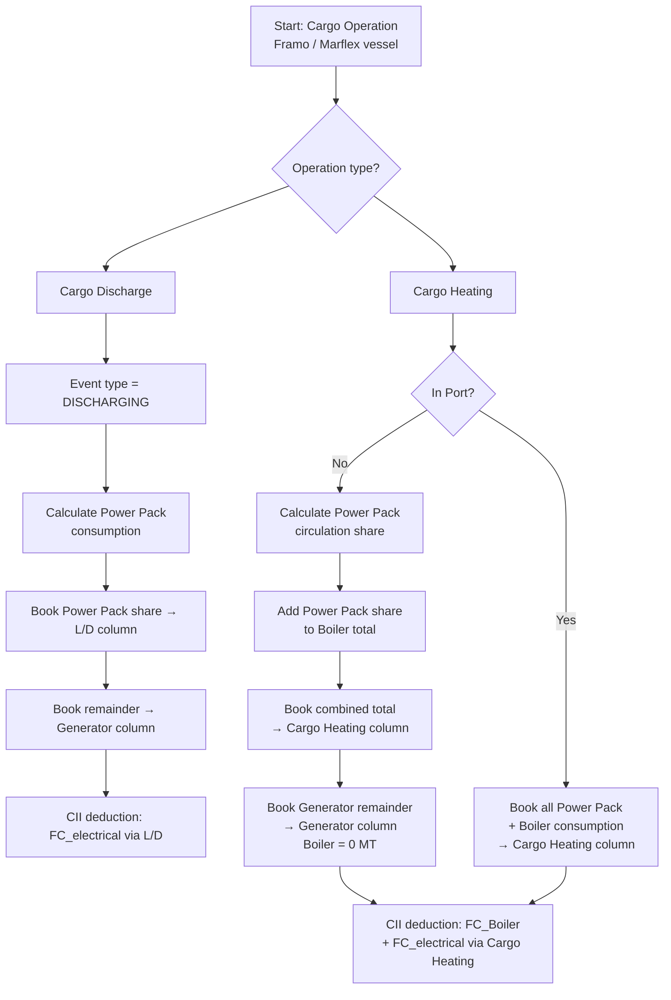
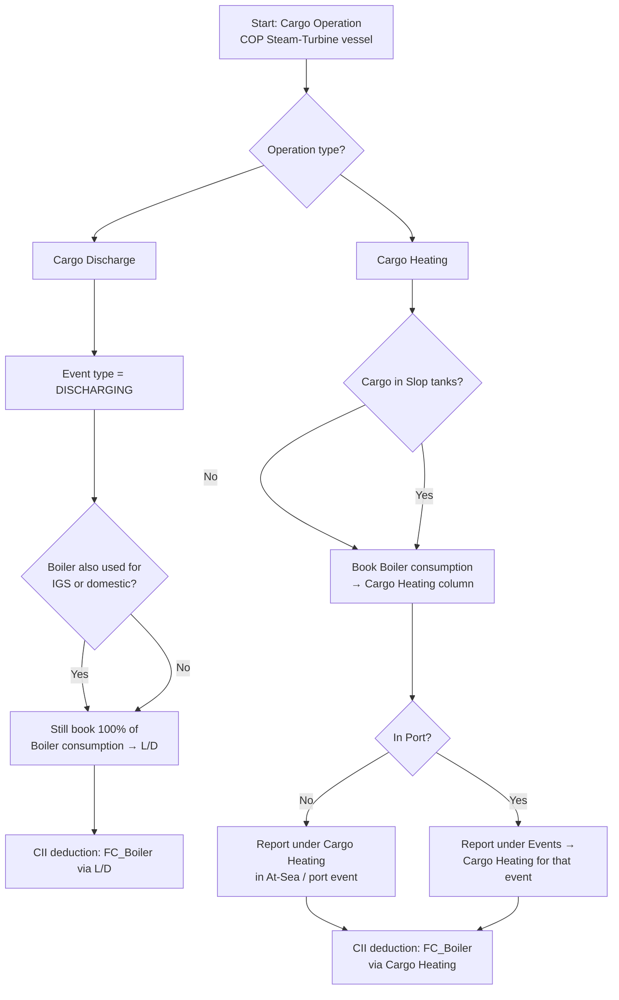

<Card title="Download PDF" icon="file-pdf" href="/pdfs/03-Cargo-Discharge-and-Heating.pdf">Open the original PDF guideline</Card>

## Overview

CII allowance for Cargo Discharging and Cargo Heating is lost if bunker consumption is not reported under the correct column in the Metaweave Events / Used For / Bunker ROB sections. Incorrect attribution directly affects the vessel's overall CII rating.

## Regulatory Background

The following deductions from attained CII are defined in MEPC.355(78):

| Parameter | What it covers |
|---|---|
| **FC_electrical,j** | Mass (g) of fuel type j consumed for electrical power production — deductible for discharge pumps on tankers |
| **FC_Boiler,j** | Mass (g) of fuel type j consumed by the oil-fired boiler — deductible for cargo heating and cargo discharge on tankers |
| **FC_others,j** | Mass (g) of fuel type j consumed by stand-alone engine-driven cargo pumps during discharge — deductible for tankers |

---

## Ships Fitted with Framo or Marflex Pumps

### Cargo Discharge — Framo / Marflex

<Steps>
  <Step title="Book all Power Pack consumption under L/D">
    Report the consolidated fuel consumption of **all Diesel and Electric Power Packs** under **Events → L/D** for the relevant fuel grade.

    <Warning>
      The **L/D** column must only be used for event type **DISCHARGING**. Do not use it for other event types.
    </Warning>
  </Step>

  <Step title="Remove Power Pack share from the Generator column">
    Any consumption attributed to Power Packs during cargo discharge must **not** remain in the **Generator** column. Move the Power Pack portion to **L/D**.

    **Example:**

    | Item | Value |
    |---|---|
    | Total Generator consumption | 4.8 MT |
    | Calculated Power Pack consumption | 1.2 MT |

    **Report in Metaweave as:**

    | Column | Value |
    |---|---|
    | Generator | 3.6 MT |
    | L/D | 1.2 MT |
  </Step>
</Steps>

### Cargo Heating — Framo / Marflex

Cargo heating is reported **only** when heating cargo in cargo tanks (using steam coils or deck heaters). It is **not** reported when heating slops stowed in Slop / ROT tanks.

<Steps>
  <Step title="Book all Boiler consumption under Cargo Heating">
    All Boiler consumption for Cargo Heating must be reported under the **Cargo Heating** column.

    <Note>
      Do **not** report it under **Boiler**, even if the Boiler is simultaneously being used for other purposes during Cargo Heating.
    </Note>
  </Step>

  <Step title="Move Power Pack share from Generator and L/D to Cargo Heating">
    Calculated consumption for Power Packs used for **cargo circulation** during Cargo Heating must **not** be included in **Generator** or **L/D**. It must be added to **Cargo Heating**.

    **Example:**

    | Item | Value |
    |---|---|
    | Total Generator consumption | 4.5 MT |
    | Total Boiler consumption | 7.2 MT |
    | Calculated Power Pack consumption | 1.2 MT |

    **Report in Metaweave as:**

    | Column | Value |
    |---|---|
    | Generator | 3.3 MT |
    | Cargo Heating | 8.4 MT (= 1.2 + 7.2) |
    | Boiler | 0 MT |
  </Step>

  <Step title="In-Port Cargo Heating">
    If Cargo Heating is conducted **In Port**, report the consolidated consumption of all Diesel / Electric Power Packs **and** the Boiler under the single **Cargo Heating** category for the appropriate event and fuel grade, following the notes above.
  </Step>
</Steps>

### Framo / Marflex Flowchart

---

## Ships Fitted with C.O.P. (Steam-Turbine Cargo Pumps)

### Cargo Discharge — COP

<Steps>
  <Step title="Book entire Boiler consumption under L/D">
    Report the fuel consumption of the Boiler used for cargo discharging (via COP) under **Events → L/D** for the relevant fuel grade.

    <Warning>
      The **entire** Boiler consumption during Cargo Discharge must be reported as **L/D** — not under **Boiler** or **IGS** — even if the Boiler is simultaneously being used for Inert Gas (flue gas) generation or domestic use during discharging.
    </Warning>
  </Step>
</Steps>

### Cargo Heating — COP

Cargo heating is reported **only** when heating cargo in cargo tanks.

<Note>
  Fuel consumed for heating slops in Slop / ROT tanks must **not** be reported as Cargo Heating — it must be reported under **Boiler**. However, if Slop tanks are being used to carry cargo, fuel used for heating those tanks must be reported under **Cargo Heating**.
</Note>

<Steps>
  <Step title="Book entire Boiler consumption under Cargo Heating">
    Report the entire Boiler consumption under the **Cargo Heating** column for the relevant fuel grade.

    <Note>
      All Boiler consumption for Cargo Heating must be reported as **Cargo Heating** and **not** under **Boiler**, even if the Boiler is being used for another purpose during Cargo Heating.
    </Note>
  </Step>

  <Step title="In-Port Cargo Heating">
    If Cargo Heating is conducted **In Port**, report the entire Boiler consumption under **Events → Cargo Heating** for the appropriate event and fuel grade.
  </Step>
</Steps>

### COP Flowchart

