<Card title="Download PDF" icon="file-pdf" href="/pdfs/02-Metaweave-Event-Scenarios.pdf">Open the original PDF guideline</Card>

Correct use of Metaweave Events for calculating the carbon footprint as required by IMO-DCS and EU-MRV.

<Warning>
We lose the CII allowance for Cargo Discharging, Cargo Heating, STS, Ice and Emergency operations if the corresponding bunker consumption is not reported in the correct Event / Voyage-flag in Metaweave. This eventually affects the overall CII rating of the vessel.
</Warning>

---

## Voyage — as defined by MRV

### Starting and ending point of voyages

The EU-MRV regulation applies the **berth-to-berth** concept. A voyage **starts at departure from the last berth of one port of call and ends on arrival at the first berth of the next port of call**.

Sailing with a pilot and/or anchoring while waiting for port entrance are part of the voyage. Time spent "at sea" **excludes** anchored periods, but fuel consumed at anchor **is included in Port consumption**.

Because of the complexities of distinguishing each stage of a voyage, Metaweave uses Events to aid this process.

### Fuel consumption "IN PORT"

Fuel consumption "in port" is the total fuel from the time the ship arrives at the first berth of a port up to the time the ship leaves the last berth of the port where commercial cargo operations took place.

This includes fuel for:

- Cargo operations at any berth in the same port
- Movement from one berth to another
- Anchorage consumption (while the port call is ongoing)
- Ship-to-ship transfers within the port area
- Moving out to sea for tank cleaning and returning to a berth of the same port

### Fuel consumption "AT SEA"

All other fuel consumption is "At Sea".

### Arrival and Departure for ports where cargo operations are conducted

Metaweave uses Events to identify Arrival and Departure for regulatory purposes:

- The **end time of the `SHIFTING TO BERTH` event after the Arrival report** is the **Arrival** time for MRV / DCS.
- The **start time of the `SHIFTING FROM LAST BERTH TO SEA` event** is the **Departure** time for MRV / DCS.

---

## Important points to consider

| Rule | Detail |
|------|--------|
| **Arrival / Departure at noon** | If an Arrival or Departure falls exactly at noon, submit only the Arrival / Departure report — do not also submit a Noon report for that timestamp. |
| **Minimum spacing** | Time between any two reports must be at least 01 minute and should never be identical. |
| **Minimum consumption** | Consumption for any fuel grade in use must be reported for any event with a duration greater than 6 minutes, otherwise the validation layer will warn. A minimum of 0.01 MT is acceptable. Events shorter than 6 minutes may be reported with zero distance and zero consumption. |
| **Coverage** | Events reported in an "In Port" Noon report must cover the entire duration of the report with no gaps and no overlaps, and must not extend before or after the report period. Make sure the correct time zone is used for all event timestamps. |
| **Idle in Port** | Use `IDLE IN PORT` only when there are no cargo operations, or when cargo operations have stopped for a period greater than 30 minutes while the vessel is at anchor or at berth. |
| **Drifting = entire duration** | If the vessel is ordered to stop and drift, the entire duration is reported as `DRIFTING` — including any short periods of main-engine use to adjust position. All distance and consumption during the drift (with or without the main engine) must be included in this single event. |
| **L/D tab** | Use only during discharge operations. |
| **Sea Steaming Hrs vs ME Hrs** | Sea Steaming Hrs = duration the ME was used for normal sea passage, excluding any slowdown, stoppage or drifting. Main Engine Hrs = entire duration the ME was used, including Sea Steaming Hrs. Sea Steaming Hrs can never be greater than ME Hrs. |

---

## Events which may be used for "AT SEA" Noon reports

Only the following events should be used in At-Sea Noon and Arrival reports. No other events are required.

1. `STOPPAGE FOR SAFETY REASONS`
2. `REDUCTION FOR SAFETY REASONS`
3. `SPEED UP`
4. `DRIFTING`
5. `NAVIGATING IN ICE`
6. `NAVIGATING TO REFUGE PORT`
7. `SAR/PIRACY`

**Correct sequencing of events is very important** — see the scenarios below.

## Events which may be used for "IN PORT" reports

Only the following events should be used in In-Port Noon and Departure reports:

- `SHIFTING TO ANCHORAGE`
- `IDLE IN PORT`
- `SHIFTING TO BERTH`
- `LOADING`
- `DISCHARGING`
- `SHIFTING FROM LAST BERTH TO SEA`
- `CANAL/STRAIT TRANSIT`
- `NAVIGATING IN ICE` *(ice-class vessels only)*
- `REDUCTION FOR SAFETY REASONS`

## Do not use these events in performance reports

Metaweave's event drop-down is shared with the SOF Report, the Delay Report and the Port Performance Survey. The following events belong **only** in those reports and **must not** be used in Noon / Arrival / Departure:

`NOR TENDERED`, `ALL FAST`, `CLEAR FROM BERTH`, `LAST LINE`, `HOSES CONNECTED`, `HOSES DISCONNECTED`, `COMMENCED LOADING`, `COMPLETED LOADING`, `COMPLETED DISCHARGE`, `CREW CHANGE`, `STORES DELIVERY`, `SURVEYOR ON BOARD`, `COC INSPECTION`, `U/W INSPECTION/CLEANING`, `HULL CLEANING`, `AWAITING ORDERS`, `CARGO DOCUMENTS ON BOARD`, `OFF HIRE`, `OFF HIRE REVERSE`, `PLANNED OFF HIRE`, `OWNERS MATTER`, `CHARTERERS REQUEST`, `DEVIATION`, `BREACH OF TCP`, `CHANGE OF MANAGEMENT`, `DD DEVIATION TIME`, `POOL BUNKERING`, `SCRUBBER OFF TIME`, `ECA SCRUBBER BREAKDOWN`, `SPD ADJUST FOR HRA`, `STOPPED FOR HRA`, `STOPPED FOR ICE`, `EXCESS PUMPING TIME`, `NO FREIGHT RECEIVED`, `NO TEMPLATE`, `U/PERFORMANCE`, `UNDERPERFORMANCE CLAIM`, `PERFORMANCE`, `CONSEQUENTIAL LOSS`, `VARIATION IN SPEED`, `INTERRUPT SEA PASSAGE`, `END OF SEA PASSAGE`, `AGREEMENT`, `ANCHOR UP`, `ANCHORED`, `MULTIFUNCTION`, `OTHER`, `TIME`, `WEATHER`, `PASSING`, `DISTRESS CALL`, `HOLD FAILURE`, `HOLDS / TANK FAILURE`, `HULL DAMAGE`, `ENGINE PROBLEMS`, `MACHINERY BREAKDOWN`, `TECHNICAL PROBLEMS`, `GROUNDING`, `FIRE`, `MEDICAL`, `OWNERS MATTERS`, `REPAIR`, `REPAIRS`, `DRY DOCK`, `FUELING`, `CLEANING`.

---

## Operational Scenarios

### Scenario 1 — Typical Port Call (Single and Multiple Berths)

A standard port call with optional anchorage on arrival, cargo operations at one or more berths, and departure to sea.

#### Single berth

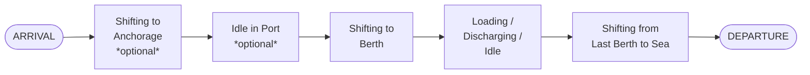

#### Multiple berths

Repeat the **Shift to Berth → Load/Disch/Idle** block for each berth. Between berths, if the vessel went to anchor, insert **Shift to Anchor → Idle in Port → Shift to Berth**.

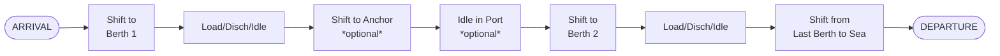

<Note>
If the vessel shifts to anchor after the last berth, follow Scenario 2 instead.
</Note>

---

### Scenario 2 — Departure from Berth → Anchor → Start Sea Passage

Covers the case where the vessel departs the last berth, anchors again before commencing sea passage, and optionally transits a canal/strait before the Departure report.

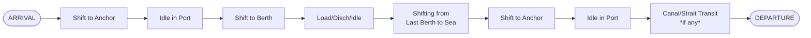

**Example:** Vessel departs from last berth at 18:00 and proceeds to anchorage, lets go anchor at 18:48:

- Event `SHIFTING FROM LAST BERTH TO SEA` from **18:00 to 18:47** with the **actual distance and consumption** for all categories.
- Event `SHIFTING TO ANCHORAGE` from **18:47 to 18:48** with distance = 0 and consumption = 0.01 MT for Main Engine only.

---

### Scenario 3 — Back-to-Back Voyages in the Same Port

Two consecutive voyages that share the same port, requiring a back-to-back Departure/Arrival pair to split the voyage chain correctly.

#### Same berth (change of voyage number or charterer)

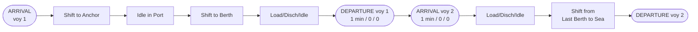

#### Berth → Anchor → Berth (voyage split at anchorage)

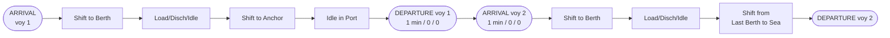

<Note>
Instructions on when to submit the back-to-back Departure+Arrival pair will be given by the Operator. The voy 1 DEPARTURE / voy 2 ARRIVAL pair is inserted between the Idle-in-Port and the next Shift-to-Berth.
</Note>

---

### Scenario 4 — Voyages Between Two Ports in the Same Geographical Area

Short inter-port voyages (e.g. Texas City → Houston, or multiple ports on the Mississippi River) where an artificial 1-minute Departure/Arrival pair splits the voyage chain into two regulatory voyages.

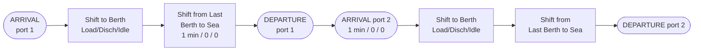

<Note>
The Departure / Arrival timestamps for the intermediate port are both artificial 1-minute events — they exist only to split the voyage chain into two regulatory voyages.
</Note>

---

### Scenario 5 — Shifting to Sea from Anchorage Due to Bad Weather

The vessel is at anchorage awaiting a berth when bad weather forces it to sea, after which it returns to anchor and then proceeds to berth.

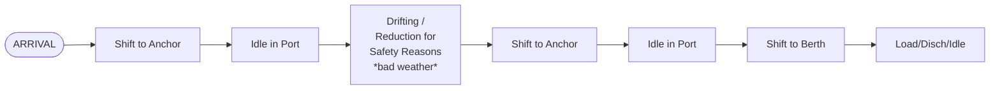

<Note>
The entire duration of the bad-weather deviation may be reported as `REDUCTION FOR SAFETY REASONS` if the vessel is continuously sailing / drifting due to the weather.
</Note>

---

### Scenario 6 — Shifting to Sea from Berth Due to Bad Weather

The vessel is forced off berth by bad weather, departs, drifts or reduces speed, then returns to the same port to complete cargo operations.

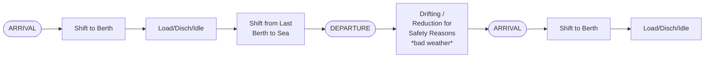

<Note>
Same rule as Scenario 5: the entire bad-weather duration is `REDUCTION FOR SAFETY REASONS` if the vessel is constantly sailing due to weather.
</Note>

---

### Scenario 7 — Canal Transits

Covers transits through canals and straits (Dardanelles, Bosporus, Great Belt, Sound, Kiel, Suez, etc.) with two sub-cases: transit with intermediate drifting/anchoring, and direct transit with no stoppage.

#### Transit with drifting and anchoring

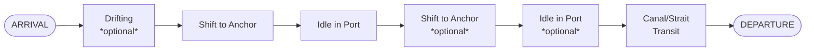

#### Transit with no stoppage

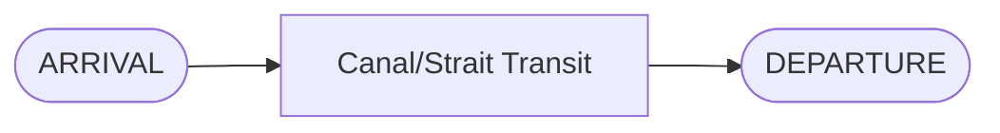

<Note>
The Departure report's **Total Cargo Onboard** should be the same as the previous Departure report's cargo figure — this confirms that no STS operation took place during transit.
</Note>

---

### Scenario 8 — Drifting or Stoppage During Sea Passage

An unplanned stoppage or drift occurs between two at-sea reports (Noon, SOSP, or EOSP). The single event spans the entire interrupted period.

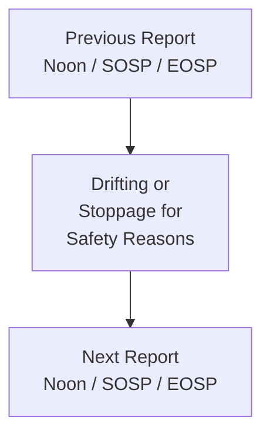

- The `DRIFTING` or `STOPPAGE FOR SAFETY REASONS` event includes **consumption and distance for the entire duration**, including any short periods of main-engine use to adjust position.
- **Sea Steaming Hrs** = zero for the duration of the event.
- **Main Engine Hrs** = the time the ME was actually used for maneuvering during the event.
- No other event is to be reported in such cases.

<Note>
The Operator will instruct if an Arrival / Departure report is required during this period.
</Note>

---

### Scenario 9 — Drifting after Arrival, before Anchoring or Berthing

The vessel commences drifting immediately after the Arrival report, prior to anchoring or proceeding to berth. The Drifting event covers the full period including any ME use for position adjustment.

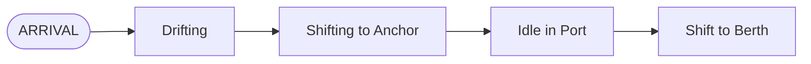

<Note>
The `DRIFTING` event includes consumption and distance for the entire duration, and also any fuel consumed / distance travelled when the main engine was used to adjust position.
</Note>

---

### Scenario 10 — STS Operations

Ship-to-Ship transfer operations require `STS Operation = Yes` to be selected in the **In-Port Noon Report** and the subsequent **Departure Report**.

#### Case A — Own vessel remains at anchor, conducts STS with multiple vessels

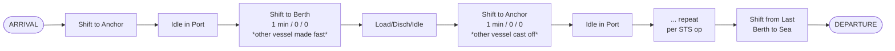

#### Case B — Own vessel maneuvers alongside other vessels (at anchor or underway)

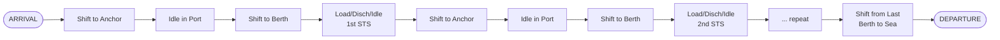

---

### Scenario 11 — Dry Dock / Sea Trials / Shifting to Cargo Berth in Same Location

Covers voyages that include a dry-dock period and/or sea trials before proceeding to a cargo berth. The dry-dock voyage is closed with a 1-minute Departure, and the cargo voyage is opened with a 1-minute Arrival immediately following.

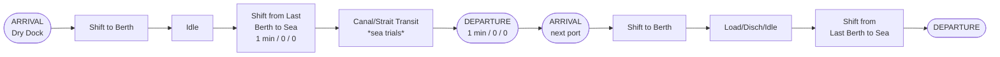

<Note>
The `SHIFT FROM LAST BERTH TO SEA` and `DEPARTURE` on the first leg close the dry-dock voyage; the immediately following `ARRIVAL` (also 1 min) opens the cargo voyage. Use the dry-dock port as the "port" on the first Departure and the next cargo port on the following Arrival.
</Note>
