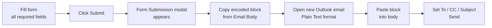
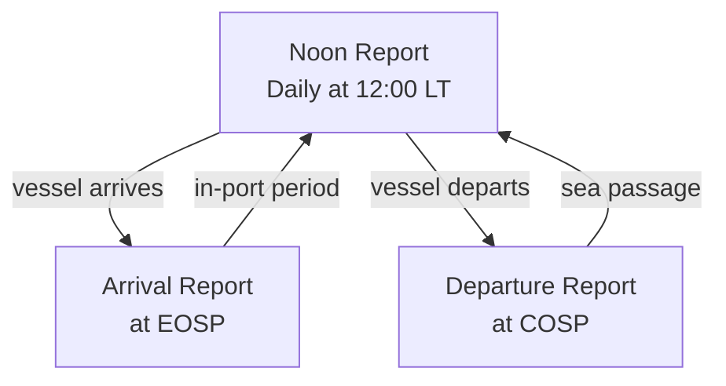

<Card title="Download PDF" icon="file-pdf" href="/pdfs/01-Metaweave-Forms-Guidelines.pdf">
  Open the original PDF guideline
</Card>

## Introduction

Metaweave Forms are self-contained HTML forms that come pre-populated with your vessel's identifiers and standardised drop-downs. They are used to send daily performance data from the vessel to the shore-side Vessel Performance System by email.

A complete Metaweave form set contains the following reports:

| Report | When to send |
|---|---|
| **Noon Report** | Every day at noon, whether the vessel is At Sea or In Port. |
| **Arrival Report** | At End of Sea Passage (EOSP) when the vessel arrives at a port. |
| **Departure Report** | At Commencement of Sea Passage (COSP) when the vessel departs a port. |
| **Bunker Report** | Every time the vessel lifts bunkers (separate from the consumption recorded inside Noon). |
| **SOF / Port Performance Survey** | After completing cargo operations at one port. |
| **MonthEnd Bunker Data** | On the last day of each calendar month. |

<Steps>
  <Step title="Save and unzip the form package">
    Save the attached ZIP file. Unzip it and keep the whole folder together.
  </Step>
  <Step title="Open the relevant form">
    Open the folder and double-click the relevant HTML file.
  </Step>
  <Step title="Always use the latest HTML file">
    Always use the latest HTML file sent to the vessel. Do not use an old copy or the browser's "Save a Copy" output — the validation layer and drop-downs are updated periodically.
  </Step>
</Steps>

---

## Submission Workflow

Metaweave forms are sent **by email** to the shore-side inbox to complete the reporting process.

<Steps>
  <Step title="Fill the form">
    Fill the relevant form with all required data. Mandatory fields are highlighted with a **blue left border**. If any mandatory field is empty or invalid, an inline error message appears and the form cannot be submitted.
  </Step>
  <Step title="Click Submit">
    Click **Submit** at the bottom of the form. A `Form Submission` modal appears with the encoded form data.
  </Step>
  <Step title="Copy the email body">
    Click the **copy** button next to the `Email Body` to copy the complete code, then paste it into your email body.

    <Warning>
      The code must be copied from `BEGIN MW FORM DATA` to the very end without any change. The verifier reads only the code block — even a single missing character will render the report unreadable.
    </Warning>
  </Step>
  <Step title="Open a new email in Plain Text">
    Open a **new email** in Outlook. Set the format to **Plain Text** (Format Text → Plain Text). Rich text or HTML format will break the encoded block.
  </Step>
  <Step title="Set the email header">
    - **To:** Fleet-specific Metaweave inbox — confirm with the office before first use.
    - **Cc:** Performance mailbox + any other party required by your operator.
    - **Subject (standardised):** `Vessel Name // Report Type // Date` — for example `MT ABC // Noon Report // 13 April 2026`.
  </Step>
  <Step title="Send">
    Make sure the mail body contains **only the pasted form code** — no signatures, disclaimers or additional text. Send the email.
  </Step>
</Steps>

<Note>
  Metaweave forms must be sent in **regular and chronological order** (Noon every day, Arrival at EOSP, Departure at COSP, etc.).
</Note>

---

## Noon Report

The Noon Report must be sent **every day at noon** regardless of whether the vessel is At Sea or In Port.

<Note>
  A Noon Report is **not required** only if an Arrival or Departure report falls exactly at noon local time on that date — in which case report the exact noon time as `12:00 LT` with the appropriate GMT offset on the Arrival/Departure report itself.
</Note>

### Vessel (pre-populated)

| Field | Notes |
|---|---|
| IMO Number | Auto-populated. Verify it matches your vessel before filling anything else. If wrong, stop and request a fresh template from the office. |
| Vessel Name | Auto-populated. |
| Vessel Code | Auto-populated. |

### Voyage

| Field | Notes |
|---|---|
| **Voyage Number** | Current ongoing voyage number (e.g. `33`, `33L`, `33-1`). |
| **Location** | `In Port` or `At Sea`. Several downstream fields and the list of allowed events depend on this selection. |
| **Date/Time** | Report date and time in **Local time**. The associated GMT offset drop-down must be set to the time zone the vessel is currently following. |
| **Latitude / Longitude** | Position at the time of the report, in the format `DD MM' SS" N/S` and `DD MM' SS" E/W`. The form auto-formats the string when you tab out of the field. |
| **Vessel Condition** | `Ballast` or `Laden`. |
| **Port** | Name of the port. Required for In-Port Noon, Arrival and Departure reports. Use the autocomplete — do not free-type. |
| **Port ETD** | Estimated Time of Departure. Fill if the Noon report is while the vessel is at berth and an ETD is known. |
| **Within Ice Edge** | `Yes` only if the vessel is inside the ice edge at the time of the report. Ice-classed vessels only. |
| **Refuge Port Call** | `Yes` if the vessel is currently calling a refuge port due to an emergency. |
| **STS Operation** | `Yes` if the vessel is currently carrying out or part of an STS operation. |
| **Remarks** | Free text (max 500 chars). Use for anything not captured by a specific field. |
| **Upcoming Ports table** *(At-Sea Noon only)* | Add the next port with Upcoming Port, Via, ETA + GMT offset, Distance to Go, Projected Speed. |

### Distance and Vessel

| Field | Notes |
|---|---|
| **CP / Ordered Speed (knots)** | The Charter Party or ordered speed for the passage. If the vessel has not been ordered to follow CP speed (eco speed, specific ETA, slow steaming, etc.) report `10`. |
| **Observed Distance Since Last Report (nm)** | Distance in nautical miles including all distance covered during Events and Drifting. |
| **Engine Distance (nm)** | `Average RPM × Hours × Propeller Pitch`. |
| **Dist by Speed Log (nm)** | Distance from the speed log. |
| **Slip %** | Auto-calculated (read-only). |
| **Steaming Hrs** | Actual sea-steaming time between the previous report and the current one, **excluding** any stoppages, drifting or periods where the vessel deviated from ordered speed. |
| **Main Engine Hrs** | Hours the M/E was in operation between the previous and current report (may include Steaming Hrs + maneuvering). |
| **Reported Speed / Average RPM / Average KW** | Auto-calculated (read-only). |
| **Main Engine Revs** | Current total revs counter minus the previous total revs counter. |
| **Main Engine KWhrs** | Current total shaft-power counter value minus the previous value. |
| **ME Output %** | Percentage of ME output relative to MCR. |
| **Generator 1–4 Hrs / KWhrs** | Hours the generator ran since the previous report. KWhrs = `Hours × Average KW`. Example: Generator 1 ran for 5 hours at 300 KW → Generator 1 KWhrs = 1500. |
| **Aux Boiler Hours, Incinerator Hours, FW Generator Hours** | Hours of operation between the previous and current report. |
| **Avg Cargo Temp (°C)** | For Laden tankers. |
| **Heading (deg)** | Gyro heading at noon. |
| **Fwd Draft (m) / Aft Draft (m) / Mean Draft** | Fwd and Aft are typed; Mean is auto-calculated. |
| **DWT (MT) and Displacement (MT)** | Vessel condition values at noon. |
| **Total Cargo Onboard (MT in air)** *(Laden only)* | Total cargo on board. |

### Weather

Report **average weather** faced between the previous and current report — **not** instantaneous weather at the time of the report.

| Field | Notes |
|---|---|
| Air Temp | Degrees Celsius. |
| Sea Temp | Degrees Celsius. |
| Bar Pressure (bar) | |
| Wind Force | Beaufort scale, drop-down. |
| Wind Direction | Drop-down. |
| Swell | Drop-down. |
| Swell Height (m) | |
| Swell Direction | Drop-down. |
| Sea State | Drop-down. |
| Sea Height (m) | |
| Sea Direction | Drop-down. |

### Technical Parameters

All values must be **taken at the time of the noon report** (instantaneous, not averaged):

- ME Torque (Nm), ME T/Chrgr RPM
- ME Air cooler Air temp-in / -out (°C)
- ME Air cooler Water temp-in / -out (°C), Drop after air cooler
- ME Scavenge air pressure (mmWg)
- EGB Exh gas temp-in / -out (°C)
- Fuel Temp At Flow Meter (°C)
- A/E sea Load (KW)
- Stern tube Lub lost to sea (ltr)
- ROB High TBN Cylinder Oil (ltr), ROB LOW TBN Cylinder Oil (ltr)
- ROB ME Crankcase lub oil (ltr), ROB A/E lub oil (ltr)
- Total Bilge water tank ROB (CuM) and % of max
- Total Sludge tank ROB (CuM) and % of max

### Bunker ROB

The Bunker ROB section has one row per fuel grade on board. Typical grades:

| Grade | Use |
|---|---|
| `HSFO` | High-sulphur FO (outside SECA / scrubber-fitted) |
| `VLSFO` | Very-low-sulphur FO |
| `VLSFO (≤40 cST)` | Low-viscosity VLSFO grade |
| `LSMGO` | Low-sulphur marine gas oil |
| `ULSFO` | Ultra-low-sulphur FO |

For each grade, fill:

- **ROB Start, ROB End** — remaining on board at the start and end of the report period.
- **Viscosity, LCV** — for the fuel in use.
- **"Used For" columns** — consumption in MT split across consumer categories:

| Category | Description |
|---|---|
| **Propulsion** | Main engine consumption while steaming. Reported only in At-Sea Noon and Arrival reports. |
| **Maneuver** | ME consumption during in-port / anchorage maneuvering, i.e. between EOSP and COSP. |
| **Generator** | Domestic generator consumption for daily operations At Sea, At Anchorage or In Port. *(Consumption for ballasting/de-ballasting or hold cleaning goes in its own category, not here.)* |
| **L/D** | Loading / Discharging. **Use only during discharge operations.** |
| **Deballast** | Consumption for ballast / de-ballast operations. |
| **IGS** | Inert gas system. |
| **Boiler** | Domestic boiler use only. Boiler use for cargo heating goes under Cargo Heating. |
| **Incinerator** | Incinerator consumption. |
| **Cargo Heating** | Cargo heating operations. |
| **Tank Cleaning** | Tank cleaning operations. |
| **Others** | Any consumption that does not fit an above category. Explain in `24Hrs Other Cons (Type/Reason/Duration)` remarks. |
| **Flushing** | Fuel used for flushing + fuel received back into the tank after flushing. |

- **Main / Aux / Total / Adj** — auto-calculated totals per grade.

<Note>
  **In-Port reporting rule:** For **In-Port Noon** and **Departure** reports, consumption is reported inside the **Events** rows. Bunker ROB is then auto-filled from the events. Do not type directly in the Bunker ROB section for in-port reports.
</Note>

### Events

Events attribute time, distance and consumption to specific activities between the previous report and the current one. Every port activity from EOSP to COSP **must** be captured as an event. Events while at sea deduct miles, time and consumption from the performance calculation (drifting, stoppages, speed adjustments, etc.).

Each event row has:

| Column | Meaning |
|---|---|
| `Event Type` | Drop-down (see lists below). |
| `Observed Distance` | Distance in nm covered during the event. `0` for stationary events. |
| `Start Date/Time` + GMT | Local start time and offset. |
| `Start Latitude / Longitude` | Position at start. |
| `End Date/Time` + GMT | Local end time and offset. |
| `End Latitude / Longitude` | Position at end. |
| `Remarks` | Free-text description. |
| `ROB Start / ROB End` + Used-For columns | Per fuel grade — consumption during this event. |

**Event types allowed in "In Port – Noon" and "Departure" reports:**

- `SHIFTING TO ANCHORAGE`
- `IDLE IN PORT` *(only for periods ≥ 30 min when no cargo operation is in progress)*
- `SHIFTING TO BERTH`
- `LOADING`
- `DISCHARGING`
- `SHIFTING FROM LAST BERTH TO SEA`
- `CANAL/STRAIT TRANSIT`
- `NAVIGATING IN ICE` *(ice-class only)*
- `REDUCTION FOR SAFETY REASONS` *(port-approach slowdown)*
- `STS OPERATION` — captured via the **STS Operation = Yes** flag on the Voyage section, not a dedicated event row.

**Event types allowed in "At Sea – Noon" and "Arrival" reports:**

- `DRIFTING`
- `NAVIGATING TO REFUGE PORT`
- `REDUCTION FOR SAFETY REASONS`
- `SAR/PIRACY`
- `SPEED UP`
- `STOPPAGE FOR SAFETY REASONS`
- `NAVIGATING IN ICE`

<Warning>
  **Do not use commercial / SOF events in performance reports.** The Events drop-down contains many additional types used only in the SOF Report and Delay Report (e.g. `NOR TENDERED`, `ALL FAST`, `HOSES CONNECTED`, `LAST LINE`, `CREW CHANGE`, `OFF HIRE`, `AWAITING ORDERS`, `STORES DELIVERY`, `U/W INSPECTION/CLEANING`, etc.). These must **not** be used in Noon / Arrival / Departure reports — they belong in the SOF Report.
</Warning>

### Scrubber

- **Scrubber in Operation:** `Yes`, `No` or `NA` (for vessels without a scrubber).
- **Current Mode of Scrubber:** `0.50%` or `0.10%` depending on the mode the scrubber is running in.

### FOWE System

- **Is FOWE system installed?** `Yes` / `No`.
- **Was EFO (Emulsified FO) used?** `Yes` / `No`.

Fill these every noon — the shore system uses the answers to compute fuel-switch allowances.

<Warning>
  These fields must be filled on every Noon / Arrival / Departure report, regardless of whether the vessel has a FOWE system installed. An empty field is treated as a validation error.
</Warning>

### Slops and Fresh Water

| Field | Notes |
|---|---|
| **Slops ROB (CuM), Slops Oil (CuM), Slops Water (CuM)** | Tankers. |
| **Fresh Water ROB (MT)** | |
| **Fresh Water Received (MT)** | Since the last report. |
| **Fresh Water Consumed (MT)** | Since the last report. |
| **Daily FW production (MT)** | |
| **Charterer Cleaning Kit Onboard / Charterer Cleaning Chemicals ROB** | Tankers. |

### Master's Name

**First** and **Last** name of the reporting Master. Required.

### Remarks

Before submitting, double-check:

- `24Hrs Other Cons (Type/Reason/Duration)` — explain any fuel reported under the `Others` column.
- All mandatory fields are filled (no blue-bordered field left empty, no inline error visible).

---

## Arrival Report

The Arrival Report is submitted at **End of Sea Passage (EOSP)**.

<Note>
  Maneuvering after EOSP (pilot boarding, shifting to anchorage, idling at anchor, shifting to berth) is **not** part of the Arrival report — it belongs in the **next In-Port Noon report** as events.
</Note>

Most fields are identical to the Noon report. The Arrival-specific fields are:

### Voyage (Arrival-specific)

| Field | Notes |
|---|---|
| **End of Sea Passage** | Date/time of EOSP in Local time + GMT offset. |
| **Port** | Arrival port. |
| **Latitude / Longitude** | Position at EOSP. |
| **Within Ice Edge** | `Yes` if EOSP is inside the ice edge. |
| **Refuge Port Call** | `Yes` if this is a refuge-port arrival. |
| **Miles in SECA** | Nautical miles steamed inside any SECA since the last departure. |
| **Water Type** | `Sea` / `Brackish` / `Fresh` — used for draft/displacement normalisation. |
| **Remarks** | Free text. |

### Bunker ROB

Consumption since the last Departure / Noon is reported here as usual. At-Sea rules apply (Propulsion in the `Propulsion` column; no in-port events in this report).

### Events

Only At-Sea event types (Drifting, Stoppage for Safety Reasons, etc.) may appear on the Arrival report. See the At-Sea events list in the Noon section above.

---

## Departure Report

The Departure Report is submitted at **Commencement of Sea Passage (COSP)**. Most fields are identical to the Noon report. The Departure-specific fields are:

### Voyage (Departure-specific)

| Field | Notes |
|---|---|
| **Start of Sea Passage** | Date/time of COSP in Local time + GMT offset. |
| **SBE Engine At Berth** | Date/time the Standby Engine was rung at berth (before Start of Sea Passage). |
| **Port** | Departure port. |
| **Latitude / Longitude** | Position at COSP. |
| **Vessel Condition** | `Ballast` after a full discharge, `Laden` after a full load. |
| **STS Operation** | `Yes` if the completed port call included an STS operation. |
| **Upcoming Ports table** | Next port, via, ETA + GMT, distance to go, projected speed. |

### Berthing–Unberthing Details

This fieldset is **unique to the Departure report**. Record the times of key port events:

- Pilot on board, First line, All fast
- Cargo operations start / stop
- Last line, Pilot away
- Any berth shifts during the port call

<Note>
  Use this fieldset for simple timestamps only. Do **not** repeat these events in the Events table — the shore system uses Events for performance calculation and this fieldset for operational visibility.
</Note>

### Events

All in-port events from Arrival to Departure must be logged here. Use the in-port event-type list from the Noon section above. Bunker consumption is booked inside the events (see next section).

---

## Reporting Bunker Consumption "In Port" — Noon and Departure Reports

In the **In Port – Noon Report** and **Departure Report**, fuel consumption is reported **inside the Events rows only**. The `BUNKER ROB` section is then **auto-filled** from the event totals — do not type anything directly in the Bunker ROB section for in-port reports.

Rules:

- Every minute from EOSP (Arrival) to COSP (Departure) must be covered by a contiguous chain of events, with no gaps and no overlaps.
- For each event row, fill ROB Start and ROB End per fuel grade and allocate consumption across the Used-For columns.
- If a short event (< 6 min) has non-zero consumption, report a minimum of `0.01 MT` — the validation layer will otherwise warn you.
- `Idle in Port` is only used when there are **no cargo operations** and the stoppage lasts **more than 30 minutes**.

---

## FAQs

**Q. Can ME consumption be reported under Propulsion during shifting between berths or in-port maneuvering?**
A. No. ME consumption from EOSP (Arrival) to COSP (Departure) must be reported under `Maneuver`, not `Propulsion`.

---

**Q. When should Vessel Condition be changed from Ballast to Laden (or vice-versa)?**
A. Once the vessel completes a **full discharge** and departs the port, set Vessel Condition to `Ballast` in the Departure report. Once the vessel completes loading (full or partial), set Vessel Condition to `Laden` in the Departure report. The condition reported in In-Port Noon reports must match the Arrival report.

---

**Q. Can Steaming Hrs and Main Engine Hrs be different?**
A. Yes. Steaming Hrs is `0` for In-Port Noon and Departure reports (no sea passage). Main Engine Hrs is the time the engine was actually used during the report period — it can be non-zero in port for maneuvering.

---

**Q. What is the threshold to report a stoppage as an event?**
A. Any cargo-operation stoppage of **more than 2 hours** must be reported as an `IDLE IN PORT` event. Any sea-passage stoppage for safety reasons of **more than 6 minutes** must be reported as a `STOPPAGE FOR SAFETY REASONS` event.

---

**Q. How should events be reported in the Noon report immediately after Arrival?**
A. Events in that first In-Port Noon cover the period from **Arrival (EOSP) to Noon** — not from the previous Noon.

---

**Q. How should Observed Distance be reported during Drifting / Idle time?**
A. Report the **total distance covered** by the vessel during the drift, whether or not the Main Engine was used to adjust position. The sum of event-row Observed Distances must match the `Observed Distance Since Last Report` in the Distance and Vessel section.

---

**Q. The validation layer is blocking submit — what do I check?**
A. Scroll through the form and look for fields with a **red inline error** that is empty. The submit button is disabled only when at least one mandatory field is empty or one error is visible. Hover over any red-outlined field to see the tooltip with the exact rule.

---

**Q. An auto-calculated field (Slip %, Reported Speed, Mean Draft ...) shows the wrong number. Can I overtype it?**
A. No — auto-calculated fields are read-only. Correct the inputs that feed the formula. For Slip %, that means Observed Distance, Engine Distance and Steaming Hrs. For Mean Draft, it means Fwd Draft and Aft Draft. For Reported Speed, it means Observed Distance and Steaming Hrs.

---

**Q. When should the FOWE fields be filled?**
A. Every noon, on every Noon / Arrival / Departure report, regardless of whether the vessel has a FOWE system installed. The shore compliance team uses these answers to compute fuel-switch allowances — an empty field means "no answer", which is treated as a validation error.

---

**Q. Scrubber is in bypass mode — what do I select?**
A. Set `Scrubber in Operation = No`. Leave `Current Mode of Scrubber` at its default. Use the Remarks field to note the reason for bypass (maintenance, outside SECA, scrubber fault, etc.).

---

**Q. I opened an old saved copy of the form by mistake and started filling it — can I still submit?**
A. No. Close it, open the **latest HTML file** from the office, and re-enter the data. The encoding format and validation rules may have changed between versions and an old submission will fail shore-side verification.
