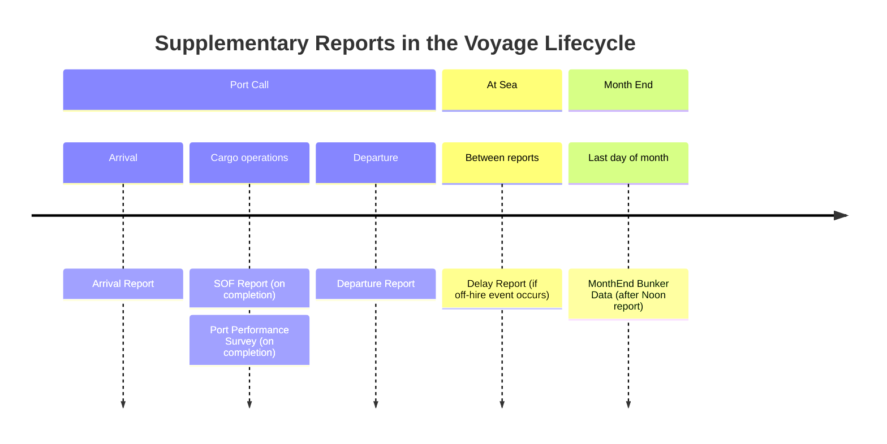
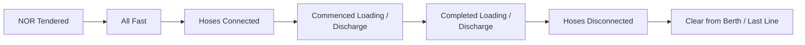
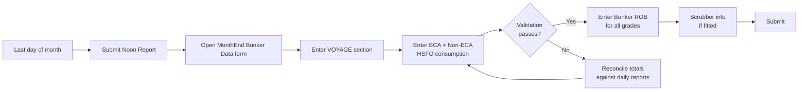

<Card title="Download PDF" icon="file-pdf" href="/pdfs/05-New-Reports.pdf">Open the original PDF guideline</Card>

Metaweave includes several supplementary reports beyond the standard Noon / Arrival / Departure cycle. This guide covers all four:

- **Statement of Facts (SOF) Report** — chronological port events after every cargo operation
- **Vessel Port Performance Survey** — terminal feedback after cargo ops
- **Delay Report** — off-hire / delay events that fall between regular reports
- **MonthEnd Bunker Data** — end-of-month SECA / Non-SECA HSFO rollup

<Note>
All four reports share the same submission flow as Noon / Arrival / Departure: click **Submit**, copy the encoded block from the Form Submission modal, paste into a plain-text Outlook email, and send to the shore inbox. See the Forms Guidelines → Submission of Metaweave Forms for the full workflow.
</Note>

## When each report is filed

---

## Statement of Facts (SOF) Report

The SOF Report records the **chronological list of port events** from Arrival to Departure. It complements — but does not replace — the Events section inside Noon / Departure reports:

| Report | Purpose |
|--------|---------|
| SOF Report | Commercial / demurrage-relevant timestamps |
| Noon / Departure Events | Performance-relevant timestamps |

**When to send:** After completing cargo operations at one port, before or at the same time as the Departure report.

### VOYAGE section fields

| Field | Meaning |
|-------|---------|
| Voyage Number | Current voyage number. |
| Port | Port of the SOF. |
| Port ETD SOF | Date / time the vessel departed (or will depart) the port, in local port time. |
| GMT Offset | GMT offset of the port local time. |
| Port Activity Template | Drop-down — select the port-activity template assigned by the operator for this port call. Populates the default list of rows below. |
| Remarks | Free text. |

### Port activity timeline

The SOF table contains one row per port event. Each row has:

- **Event Type** (drop-down) — typical events include: `NOR TENDERED`, `ALL FAST`, `HOSES CONNECTED`, `COMMENCED LOADING` / `COMMENCED DISCHARGE`, `COMPLETED LOADING` / `COMPLETED DISCHARGE`, `HOSES DISCONNECTED`, `CLEAR FROM BERTH`, `CREW CHANGE`, `STORES DELIVERY`, `SURVEYOR ON BOARD`, `CARGO DOCUMENTS ON BOARD`, `LAST LINE`
- **Start Date/Time** + GMT
- **End Date/Time** + GMT
- **Duration**
- **Remarks**

<Warning>
SOF events are **not** the same as Noon / Departure Events. Never copy a SOF event into a performance report. Conversely, `LOADING`, `DISCHARGING`, `IDLE IN PORT`, `SHIFTING TO BERTH`, etc. belong in Noon / Departure Events and do **not** belong in the SOF.
</Warning>

### Master's Name

First and last name. Required.

---

## Vessel Port Performance Survey

The Port Performance Survey is a short questionnaire completed at the end of the port call by the **Terminal Representative**. It captures terminal-side feedback on the vessel — legibility, communication, cargo performance, dimensions fit, etc. The Master collects the answers and submits the form.

**When to send:** At the end of the port call, together with or just before the Departure report.

### Header fields

| Field | Meaning |
|-------|---------|
| Voyage Number | Current voyage number. |
| Port | Port of the survey. |
| Date/Time | Date and time of completion. |
| Vessel Condition | Ballast / Laden. |

### Questions (1–12)

Each question is a **Yes / No** tick-box unless otherwise noted. Tick the box if the answer is Yes; leave blank otherwise.

<Steps>
  <Step title="Q1 — Safety briefing">
    Was a suitable ship and shore safety / cargo operation briefing held before cargo operations took place?
  </Step>
  <Step title="Q2 — Legislation compliance">
    Did the ship fully comply with all legislation whilst at your terminal?
  </Step>
  <Step title="Q3 — Communications">
    Were the ship's communications correct, prompt and understandable?
  </Step>
  <Step title="Q4 — Staff conduct">
    Were the ship's staff co-operative, contactable and of smart appearance?
  </Step>
  <Step title="Q5 — Cargo performance">
    Did the vessel's cargo performance meet your requirements / expectations?
  </Step>
  <Step title="Q6 — Dimensions and equipment">
    Do the vessel's dimensions and equipment suit your terminal's requirements?
  </Step>
  <Step title="Q7 — Problem-free visit">
    Was the vessel free of problems during this visit? *(If "No", describe in Q11.)*
  </Step>
  <Step title="Q8 — Required actions completed">
    Have all required actions by the vessel to your port been completed? *(If "No", describe in Q11.)*
  </Step>
  <Step title="Q9 — Return invitation">
    Would you like to see this vessel return to handle another cargo at your terminal?
  </Step>
  <Step title="Q10 — Overall Rating">
    Drop-down: **Poor / Fair / Good / Very Good / Excellent**
  </Step>
  <Step title="Q11 — Additional comments">
    Any additional comments / improvements. *(Free text — leave empty if none.)*
  </Step>
  <Step title="Q12 — Path to excellent">
    What does this vessel have to do to achieve an excellent rating? *(Free text — leave empty if none.)*
  </Step>
</Steps>

### Terminal Representative

| Field | Notes |
|-------|-------|
| Terminal Representative Name | Full name of the terminal contact. |
| Title | Job title. |
| Contact Number | Phone / direct line. |

### Submission

The Master submits the survey the same way as any other Metaweave form — click Submit, copy the encoded block, paste into a plain-text email to the shore inbox. The terminal representative does **not** submit directly.

---

## Delay Report

The Delay Report logs a **single off-hire / delay event** that does not fit the normal Noon / Arrival / Departure cadence — e.g. a prolonged equipment failure, unscheduled stoppage, or waiting for orders chargeable to a specific party.

**When to send:** As soon as the delay event is resolved, before the next scheduled performance report.

### Fields

| Field | Meaning |
|-------|---------|
| Voyage Number | Current voyage number. |
| Delay Start | Local date / time + GMT. |
| Delay End | Local date / time + GMT. |
| Delay Duration | Auto-computed from Start / End. |
| Miles | Distance covered during the delay, if any. |
| Delay Type | Drop-down — `OFF HIRE`, `PLANNED OFF HIRE`, `OFF HIRE REVERSE`, `UNDERPERFORMANCE CLAIM`, etc. |
| Reason for Delay | Drop-down — `ENGINE PROBLEMS`, `MACHINERY BREAKDOWN`, `TECHNICAL PROBLEMS`, `WEATHER`, `AWAITING ORDERS`, `CREW CHANGE`, `MEDICAL`, `STORES DELIVERY`, `HULL DAMAGE`, `FIRE`, `GROUNDING`, `BREACH OF TCP`, etc. |
| Remarks | Free text — **mandatory** for any delay flagged for a charter-party claim. |

<Warning>
When a delay is captured via a Delay Report, do **not** also capture it as an event in the current Noon / Departure report. The shore system automatically links the Delay Report to the corresponding performance report by timestamp.
</Warning>

### Fuel consumption during delay

For each fuel grade on board, enter:

| Column | Meaning |
|--------|---------|
| Fuel Type | HSFO, LSMGO, VLSFO, VLSFO (≤80 cST) |
| Consumption | MT consumed during the delay period. |
| Ending ROB | Remaining on board at delay end, in MT. |

### Master's Name

First and last name. Required.

---

## MonthEnd Bunker Data

The MonthEnd Bunker Data report is a **single summary submission per calendar month** covering total HSFO consumption split between SECA and Non-SECA areas. It is used for MARPOL Annex VI / MRV compliance reconciliation.

**When to send:** On the last day of each calendar month, after the Noon report.

### VOYAGE section fields

| Field | Meaning |
|-------|---------|
| Voyage Number | Most recent voyage number on the last day of the month. |
| Port | Current port (or `AT SEA`). |
| Vessel Condition | Ballast / Laden. |
| Form Date | Date the form is being filled. |
| Start Date / Time (GMT) | `00:00 GMT` of day 1 of the month. |
| End Date / Time (GMT) | Last minute of the month in GMT (e.g. `23:59 GMT` on day 30 / 31 / 28 / 29). |

### Consumption split

| Field | Meaning |
|-------|---------|
| ECA Consumption — HSFO only | Total HSFO consumed inside SECA / ECA zones during the month, in MT. |
| Non-ECA Consumption — HSFO only | Total HSFO consumed outside SECA / ECA zones during the month, in MT. |
| Total Consumption HSFO | Auto-computed sum of the above. |

<Note>
The form compares **Total Consumption HSFO** against the sum of HSFO consumption from all daily Noon / Arrival / Departure reports for the same month. If the difference exceeds the configured tolerance, a validation error is shown and the form cannot be submitted until the numbers reconcile.
</Note>

### Bunker ROB

For each grade on board on the last day of the month, report:

| Column | Meaning |
|--------|---------|
| ROB Start | Remaining on board at `00:00 GMT` on day 1 of the month. |
| ROB End | Remaining on board at the end of the last day of the month. |

This is a simple month-over-month reconciliation — no Used-For split is required here.

### Scrubber Info *(scrubber-fitted vessels only)*

If the vessel has a scrubber, update the cumulative scrubber running hours and mode for the month. Leave blank if the vessel has no scrubber.

### Master's Name

First and last name. Required.
