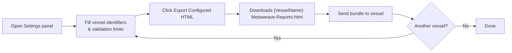
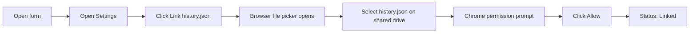
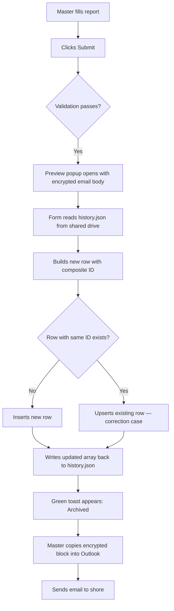
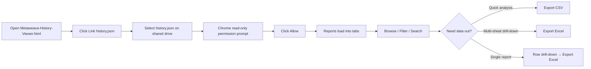

<Card title="Download PDF" icon="file-pdf" href="/pdfs/07-Settings-and-History.pdf">Open the original PDF guideline</Card>

The Metaweave form ships with two features that are independent of any single report: a **Settings panel** for vessel identifiers and parameter validation limits, and a **local history archive** that records every submitted report on the ship's shared drive so the crew can browse past submissions without a server.

This guide covers five parts:

| Part | Audience | When |
|------|----------|------|
| 1 — Shore setup | Office / superintendent | Once per vessel |
| 2 — Vessel setup | Master / officer on new computer | Once per computer |
| 3 — Every submit | Master | Automatic on each Submit |
| 4 — History Viewer | Any crew member | Any time |
| 5 — Troubleshooting | Master / IT | When something goes wrong |

---

## Part 1 — Shore: Configure the Form Before Sending

The form is delivered to the vessel as a single `.html` file alongside an empty `history.json` and the History Viewer. Before sending, the office fills in vessel identifiers and validation limits so the Master doesn't have to retype them on every machine.

<Steps>
  <Step title="Open Settings">
    Click the **⚙ Settings** button in the top-right of the form header. The Settings modal opens.
  </Step>

  <Step title="Fill vessel identifiers">
    Complete the following fields for this vessel:

    | Field | Meaning |
    |-------|---------|
    | IMO Number | Vessel's IMO number. Required. |
    | Vessel Name | Full vessel name (appears in the email subject). |
    | Vessel Code | Short code used in archive filenames. Typically 4–6 characters. |
    | Report Email Address | The shore inbox the form's `mailto:` link should target. |
  </Step>

  <Step title="Set validation limits">
    Below the vessel section is **Validation Limits**, organised into collapsible groups. Click any group header to expand it.

    | Group | Parameters |
    |-------|-----------|
    | Draft & Displacement | Fwd Draft, Aft Draft, DWT, Displacement |
    | Speed & Distance | Reported Speed, CP Speed, Observed Distance, Engine Distance, Speed Log Distance |
    | Main Engine | ME Hours, ME Revs, ME KWhrs, Average KW, ME Output, Steaming Hours |
    | Generators & Auxiliary | Gen 1–4 Hours / KWhrs, A/E Sea Load, Aux Boiler Hours, Incinerator Hours, FW Generator Hours |
    | Tanks & ROB | Bilge Water ROB, Sludge ROB, Fresh Water ROB, Slops ROB |
    | Lub Oil ROB | High TBN, Low TBN, ME Crankcase, A/E Lub Oil |
    | Fuel ROB | HSFO, LSMGO, VLSFO, VLSFO (≤80 cSt) |
    | Weather | Air Temp, Sea Temp, Bar Pressure, Avg Cargo Temp, Heading |
    | BDN Quantity (MT) | Per fuel grade |
    | Fuel Density (kg/m³) | Per fuel grade |
    | Sulphur Content (%) | Per fuel grade |
    | Viscosity (cSt) | Per fuel grade |

    For each parameter, type the **Min** and **Max** values acceptable for this vessel. Both fields are optional — leave blank to disable that bound.

    <Note>
      Values outside the configured range trigger an **orange non-blocking warning** beside the input on the report form. The form still submits, but the vessel sees the warning and can correct it before sending.
    </Note>
  </Step>

  <Step title="Export Configured HTML">
    Click the green **⬇ Export Configured HTML** button in the modal footer.

    This does three things in one click:
    1. Saves the settings to the shore browser's localStorage (same as Save & Apply)
    2. Embeds the settings directly into the HTML file source
    3. Downloads `{VesselName}-Metaweave-Reports.html`

    <Note>
      Browser localStorage is tied to the machine and file path — it does not travel with the file. **Export Configured HTML** bakes the settings into the HTML itself so the vessel crew see the correct vessel name, IMO, and limits the moment they open the file, on any computer.
    </Note>

    When the crew opens the exported file, the Settings modal already shows the configured values. They do not need to type anything.
  </Step>

  <Step title="Send the bundle to the vessel">
    Email or copy via USB the following three files together, keeping them in the **same folder**:

    1. `{VesselName}-Metaweave-Reports.html` — the configured form for this vessel
    2. `Metaweave-History-Viewer.html` — the read-only history browser (one copy, never modified)
    3. `history.json` — empty (`[]`) on day 1, grows on the vessel over time

    Tell the vessel to keep all three files in the same shared-drive folder (e.g. `\\ship-nas\Performance\Metaweave\`) and **never rename them**.
  </Step>

  <Step title="Configuring for the next vessel">
    The base form on the shore computer is unchanged after an export. To configure for another vessel:

    1. Open Settings again
    2. Overwrite the vessel details and limits with the new vessel's values
    3. Click **⬇ Export Configured HTML** again
    4. A new file `{Vessel2Name}-Metaweave-Reports.html` downloads
    5. Send that file to Vessel 2

    Each exported copy is fully independent — changing settings for Vessel 2 does not affect the file already sent to Vessel 1.
  </Step>
</Steps>

---

## Part 2 — Vessel: One-Time Setup Per Computer

The first time the Master opens the form on a new computer, the local history archive is not yet linked. He needs to point the form at the shared `history.json`.

<Steps>
  <Step title="Open Settings and link history.json">
    Click the **gear icon** on the left sidebar rail to open Settings. The **Local History File** section is at the top.

    Click **Link history.json**. A standard browser file picker opens. Navigate to the shared drive folder and select `history.json`.

    Chrome shows a permission prompt — click **Allow** to grant read and write access for this file.

    The status line should now read **Linked: history.json · 0 rows · last write —** in black. The **Link** button is replaced by **Re-link** and **Unlink** buttons.

    <Note>
      The form remembers this link in the browser's IndexedDB. The Master only needs to re-link if he clears browser data, switches browsers, or the file is moved to a different path.
    </Note>
  </Step>

  <Step title="Per-session Allow dialog">
    Every time the form is reopened in a new browser session, Chrome asks **"Allow this site to re-access history.json?"** before the first archive write. Click **Allow** once per session — every Submit thereafter writes silently.
  </Step>

  <Step title="Multiple officers sharing the file">
    Each daily report copy is still passed serially around the ship (2/O fills navigation → CE fills consumption → Master reviews → Master submits). **Only the Master's machine needs `history.json` linked**, because only the Master clicks Submit. Other officers' machines never need to touch the history file.
  </Step>
</Steps>

---

## Part 3 — What Happens on Every Submit

Once Settings are filled and `history.json` is linked, archival is fully automatic. There is no extra button to click.

<Steps>
  <Step title="Success path">
    1. Master fills the report and clicks **Submit**.
    2. The form validates inputs as usual.
    3. A **Preview popup** appears with the encrypted email body.
    4. In the background (typically under one second), the form:
       - Reads the current `history.json` from the shared drive.
       - Builds a new row with a stable composite ID based on the report type.
       - Inserts the row, or **upserts** it if a row with the same ID already exists (the correction case — useful when shore asks for a re-submission of an earlier date).
       - Writes the updated array silently back to `history.json`.
    5. A small **green toast** appears at the top-right of the preview:
       - **"Archived (insert). 42 rows in history."** for a brand-new report.
       - **"Archived (update). 42 rows in history."** for a correction.
    6. Master copies the encrypted block from the preview into a plain-text Outlook email and sends it.
  </Step>

  <Step title="Failure path">
    If the archive write fails for any reason — file not linked, permission denied, shared drive offline, or file locked by another process — a **red modal** appears over the preview showing the failure reason.

    The modal offers three buttons:

    | Button | What it does |
    |--------|-------------|
    | **Retry** | Re-runs the archive step. Use after fixing the underlying issue (e.g. re-linking the file or reconnecting the shared drive). |
    | **Email without archiving** | Skips the archive and proceeds directly to the `mailto:`. The report is still emailed to shore but will not appear in local history. Use only when archival is broken and the report cannot wait. |
    | **Cancel** | Closes the modal and returns to the preview. Neither archive nor email happens. |

    <Note>
      The local archive is a convenience for the vessel — the shore database is the authoritative source. If a row is missed locally because of "Email without archiving", the report is still in the shore database and can be re-archived later by editing `history.json` manually or by re-submitting.
    </Note>
  </Step>
</Steps>

---

## Part 4 — Browsing Past Reports (History Viewer)

The History Viewer is a separate HTML file that any crew member can open to browse the archived reports. It is **read-only** — it never writes to `history.json`.

<Steps>
  <Step title="First open">
    Double-click `Metaweave-History-Viewer.html` from the shared drive. The landing page appears.

    Click **Link history.json** and pick the same file from the shared drive. Chrome asks for **read** permission (not read+write — the viewer never modifies the file). Click **Allow**.

    The viewer remembers this link in IndexedDB so subsequent opens skip straight to the data, with one **Allow** click required per session.
  </Step>

  <Step title="Voyage Reports tab">
    The **Voyage Reports** tab shows Noon, Arrival, and Departure reports in one chronological list.

    **Columns:** Submitted · Type · Report UTC · Vessel · Voyage · Location · Port · Lat / Lon · Events

    **Toolbar controls:**

    | Control | What it does |
    |---------|-------------|
    | From / To date pickers | Filter by report date range. |
    | Search text box | Free-text filter over vessel, IMO, voyage, port. Debounced 200 ms. |
    | NOON / ARRIVAL / DEPARTURE pills | Toggle each report type on/off independently. |
    | **Reload** (header) | Re-reads `history.json` from disk to pick up rows added since the viewer was opened. |
    | **Re-link** (header) | Pick a different `history.json` file. |
    | **Export CSV** (header) | Exports the current filtered rows as a flat CSV with ~100 scalar columns (one row per report, all parameters). Best for quick analysis in Excel. |
    | **Export Excel** (header) | Exports a multi-sheet `.xls` with three sheets: Reports / Events / Event Bunker ROB, joined on a Row ID. Best for cross-sheet PivotTables and forensic drill-down. |
  </Step>

  <Step title="Other tabs">
    | Tab | Contents |
    |----|---------|
    | Statement of Facts | SOF reports with port and activity count. |
    | Bunker Reports | Bunker liftings with port, BDN number, and quantity. |
    | Month-End ROB | Monthly fuel ROB snapshots. |

    Each tab has the same toolbar and its own **Export CSV** / **Export Excel** buttons scoped to that report type.
  </Step>

  <Step title="Drill-down detail">
    Click any row to open the **drill-down modal**. The modal shows all scalar fields grouped into readable zones:

    > Identity / Position & Port / Vessel State / Distance & Main Engine / Generators & Auxiliary / Lub Oil & Tanks / Slops & Fresh Water / Weather / Scrubber & FOWE / Bunker / BDN / Remarks / Master

    Empty zones are hidden so the view stays tight. For reports with events, an **In-port events** or **At-sea events** section appears with one card per event — event type, start → end, observed distance, plus a compact bunker ROB table per event showing only the columns that have values.

    **Modal buttons:**

    | Button | What it does |
    |--------|-------------|
    | **Export Excel** | Exports this single report as a richly formatted `.xls` with zone-grouped tables and per-event bunker ROB tables. Best for sending one report to someone unfamiliar with the form. |
    | **Print** | Opens the browser print dialog for the modal contents. |
    | **Close** | Closes the modal (also `Esc` or click on the dimmed backdrop). |
  </Step>

  <Step title="Bulk export for analysis">
    When the office asks for "the last 6 months of noon reports" or "all bunker reports for this vessel", apply the relevant date and type filters on the appropriate tab, then click **Export CSV**. The CSV opens directly in Excel with one row per report and every numeric parameter as a column — ready for PivotTables, charts, or pasting into another spreadsheet.

    For a richer multi-sheet view (Reports + Events + Event Bunker ROB joined by Row ID), use **Export Excel** instead.
  </Step>
</Steps>

---

## Part 5 — Troubleshooting

<Warning>
  **"Archive failed: history.json is not linked"**

  The form has no FileSystemFileHandle stored for this browser profile. Open **Settings → Link history.json** and pick the file. If the Master switched browsers (e.g. Edge → Chrome) or the IT team cleared browser data, the link is gone and needs to be re-established.
</Warning>

<Warning>
  **"Permission denied" red modal**

  The Master clicked **Block** on Chrome's "Allow access to history.json?" prompt. Click **Retry** in the red modal, and when the prompt re-appears click **Allow**. Permission persists for the rest of the browser session.
</Warning>

<Warning>
  **Submit button does nothing on a copy**

  The form's **Save a Copy** button downloads the current form with values baked in. Chrome can block multiple downloads by default. The first time a download is triggered, Chrome shows a prompt asking "This file wants to download multiple files" — click **Allow**. From then on, Save a Copy and Export Configured HTML work silently.
</Warning>

<Warning>
  **Settings limits not appearing in the Settings modal after re-opening**

  The form reads limits from localStorage, which is per-file-path. If the HTML file is moved or copied to a different path, the localStorage at that path is empty.

  **Fix:** Open the file at the path where it was originally configured, OR have shore re-send the form using **Export Configured HTML**, which embeds the settings into the HTML so any copy carries them.
</Warning>

<Warning>
  **History Viewer shows "No rows match the current filters" but reports exist**

  Check the date range pickers — **From** may be set to a future date or **To** may be set in the past. Clear both fields, then check the type-filter pills if you are on the Voyage Reports tab.
</Warning>

<Warning>
  **History Viewer doesn't show the latest submitted report**

  Click the **Reload** button in the header. The viewer loads `history.json` once on open and does not poll for changes — Reload re-reads the file from disk.
</Warning>

<Warning>
  **"Permission was denied" when re-opening the History Viewer**

  You declined Chrome's per-session Allow prompt. Click **Re-link** and pick the file again, then click **Allow**.
</Warning>

<Warning>
  **A vessel made copies of the HTML and the copies don't have history linked**

  Each new copy is a different file path, with its own IndexedDB scope, so re-linking is required once per copy. Tell the Master to keep submitting from a single canonical path (e.g. always from the shared drive) and avoid making copies for daily entry.
</Warning>

<Warning>
  **Browser data was cleared / new computer / new browser profile**

  The FSA handle is gone from IndexedDB. Settings limits are gone from localStorage. Both are recoverable:

  - **For the limits:** the **Export Configured HTML** copy of the form has the settings baked into the file itself. Open that copy and the Settings panel is repopulated automatically — no localStorage needed.
  - **For the history link:** open **Settings → Link history.json** and pick the file again. The data in `history.json` is untouched — it lives on the shared drive, not in the browser.
</Warning>
