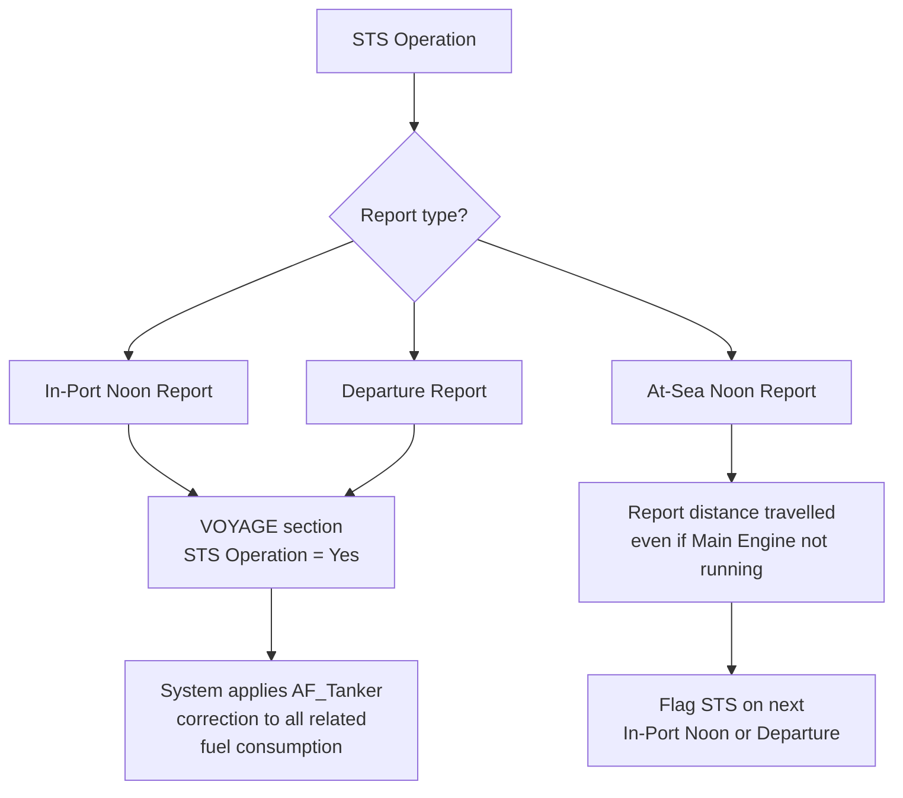
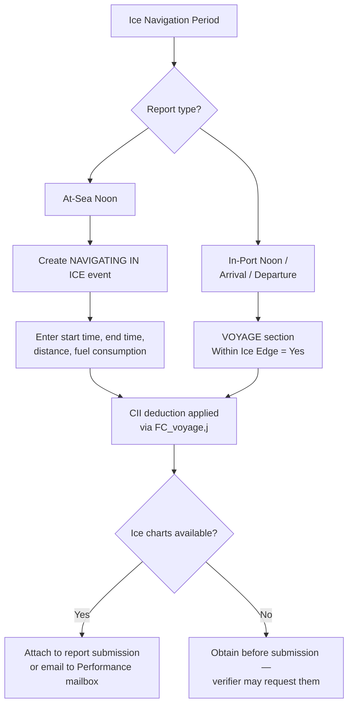
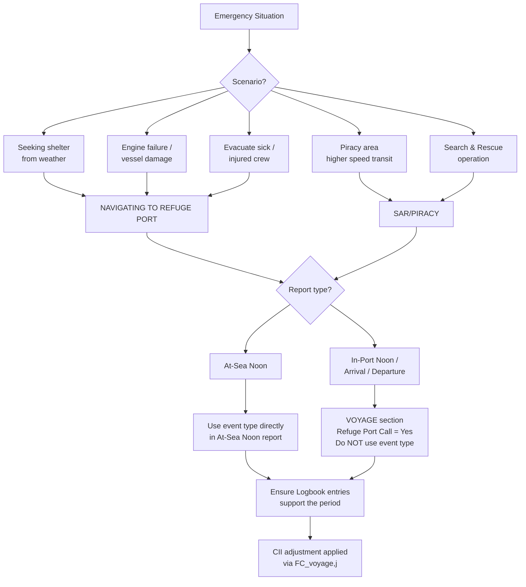

<Card title="Download PDF" icon="file-pdf" href="/pdfs/04-STS-Ice-Emergency.pdf">Open the original PDF guideline</Card>

## Overview

Correct reporting of STS operations, ice navigation and emergency periods is required for the shore system to apply the appropriate CII correction factors. Missing or incorrect flags forfeit the allowance.

## Regulatory Background

Corrections defined in MEPC.355(78):

| Parameter | What it covers |
|---|---|
| **FC_voyage,j** | Mass (g) of fuel type j consumed during voyage periods deductible when encountering MARPOL Annex VI Reg. 3.1 scenarios (safety emergencies) or sailing in ice conditions |
| **AF_Tanker** | Correction factor for tankers engaged in STS voyages — applicable to all fuel consumed in relation to the STS voyage including cargo transfer, transit, waiting at anchor or drifting, and port discharge after the STS voyage |

---

## STS Operations

A tanker engaged in an STS operation is eligible to apply a CII allowance to CO₂ emitted before, during, and after the STS operation.

### How to Flag an STS Period

The **STS Operation** field in the **VOYAGE** section is used to flag the STS period. Set it to **Yes** only when the vessel is actively performing STS operations during the report period.

| Report type | Where to set the flag |
|---|---|
| In-Port Noon Report | VOYAGE section → STS Operation = Yes |
| Departure Report | VOYAGE section → STS Operation = Yes |

<Note>
  During STS operations **underway**, report the distance moved even if the vessel's Main Engine is not in use.
</Note>

### STS Flowchart

---

## Ice Navigation

<Warning>
  Valid **only** for vessels holding an Ice Class notation. Do not use ice navigation flags on non-ice-classed vessels.
</Warning>

The CII allowance for "Time in Ice" applies when an ice-classed vessel is sailing in a sea area **within the ice edge**. The ice edge is defined by WMO Sea-Ice Nomenclature (March 2014) as the demarcation between open sea and sea ice of any kind (fast or drifting).

<Tip>
  Ice charts or ice notices related to the relevant voyage periods must be retained and attached to the Metaweave report submission, or emailed separately to the Performance mailbox. The verifier may request them.
</Tip>

### Reporting Ice Navigation by Report Type

#### In-Port Noon, Arrival, and Departure Reports

Use the **Within Ice Edge** field at the top of the **VOYAGE** section to flag the period in ice.

<Note>
  The **NAVIGATING IN ICE** event must **not** be used in In-Port Noon, Arrival, or Departure reports. Use the **Within Ice Edge** flag instead.
</Note>

#### At-Sea Noon Report

Create a **NAVIGATING IN ICE** event. The event must record:
- Start and end time of the ice navigation period
- Distance covered during the period
- Fuel consumption during the period

### Ice Navigation Flowchart

---

## Emergencies

CII adjustment is available for emergency scenarios specified in **MARPOL Annex VI Regulation 3.1** that may endanger safe navigation. All emergency periods must be supported by appropriate deck Logbook entries.

There are two event types for emergency periods:

| Event Type | Use for |
|---|---|
| **NAVIGATING TO REFUGE PORT** | Seeking shelter from weather; deviation to refuge port due to engine failure or vessel damage; deviation to evacuate a sick or injured crew member |
| **SAR/PIRACY** | Navigating at higher speed through piracy areas; Search and Rescue operations |

### Reporting Emergencies by Report Type

#### At-Sea Noon Report

Use the appropriate event type (**NAVIGATING TO REFUGE PORT** or **SAR/PIRACY**) directly in the At-Sea Noon report.

#### In-Port Noon, Arrival, and Departure Reports

Use the **Refuge Port Call** field at the top of the **VOYAGE** section to flag an emergency period at port (e.g. a forced diversion into a refuge port).

<Warning>
  The **NAVIGATING TO REFUGE PORT** and **SAR/PIRACY** events must **not** be used in In-Port Noon, Arrival, or Departure reports. Use the **Refuge Port Call** flag instead.
</Warning>

### Emergency Decision Flowchart

