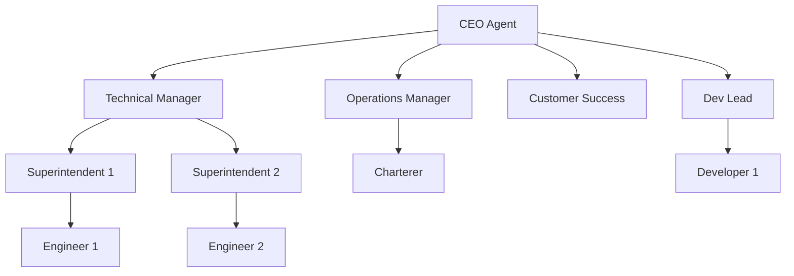

## The architecture

Lifeverse AI doesn't deploy a single AI assistant. It deploys an **AI organization** — multiple agents with defined roles, communication channels, and shared knowledge.

## Agent structure

Each agent has:

- **Role** — defined responsibilities and expertise (Technical Manager, Superintendent, etc.)
- **Authority** — scope of autonomous decision-making
- **Memory** — 14-table SQLite brain with persistent state
- **Communication** — A2A messaging for inter-agent collaboration
- **Skills** — domain-specific tools and commands
- **Schedule** — daemon-managed execution frequency

## Team organization



## Communication patterns

### Direct messaging
Agent-to-agent for specific requests, status updates, and task delegation.

### Team broadcasts
One-to-many within a team for announcements and coordination.

### Escalation chains
Automatic routing to higher authority when a decision exceeds an agent's scope.

### Urgent shouts
Priority bypass for critical external inputs (e.g., emergency notifications).

## Memory persistence

The sleep/wake model ensures agents never lose context:

1. **Sleep**: Before session ends, agent saves state to SQLite
2. **Wake**: On next session, agent loads identity + recent context + pending items
3. **Layered injection**: Only relevant memory is loaded, keeping context windows efficient

## Organizational learning

Individual agent experiences feed into a shared knowledge library:

```
Agent resolves issue → Reflects on resolution → Knowledge Library updated → All agents benefit
```

The organization accumulates institutional knowledge over time — incident patterns, maintenance best practices, regulatory updates, vendor insights.

## Design principles

<AccordionGroup>
  <Accordion title="Mirror real organizations" icon="building">
    Agent teams reflect how real companies work. Role specialization, authority levels, and communication patterns match organizational reality.
  </Accordion>
  <Accordion title="Autonomy with accountability" icon="scale-balanced">
    Agents act within their authority. Every decision is logged with rationale. Escalation happens automatically when needed.
  </Accordion>
  <Accordion title="Persistence over performance" icon="database">
    Every interaction is stored. Speed is secondary to never losing context. Maritime operations span years — so does agent memory.
  </Accordion>
  <Accordion title="Open and extensible" icon="puzzle-piece">
    Add new agent roles, skills, communication patterns, and knowledge sources without modifying the core system.
  </Accordion>
</AccordionGroup>
